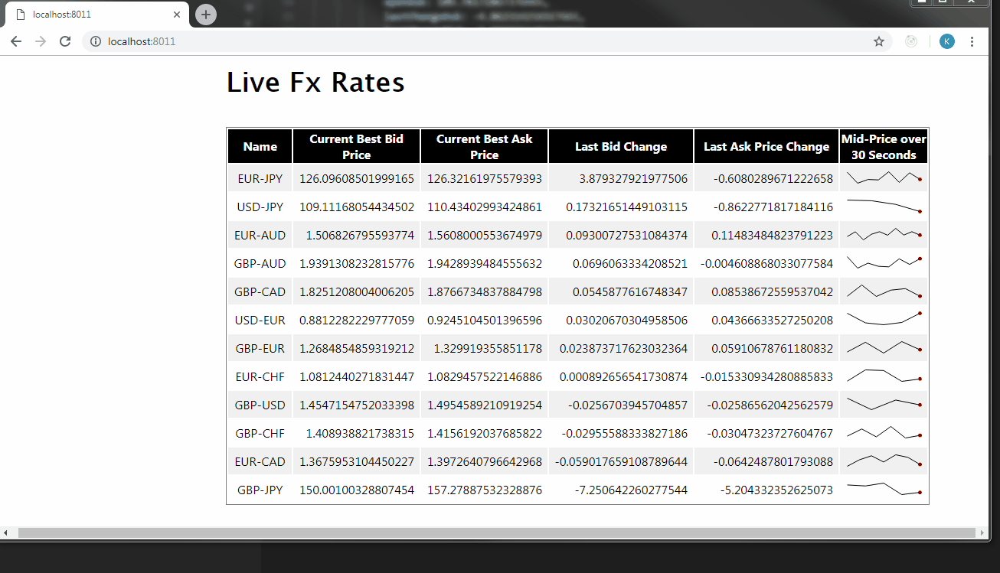

# Real Time Javascript with WebSockets

This module contains a development challenge with following requirements: 

1.  Create a page displaying real time FX pair using plain vanilla Javascript.
2.  Data should be sorted  by last bid price.
3.  Display Spark line chart of Mid-price over previous 30 seconds.
4.  Only external JS library/Node module allowed are JQuery Sparkline for Chart and Stomp.js for WebSockets
5.  Data refresh on screen should be fast!

Challenege originally came with a pseudo node server which provides currency prices.

To view them, run

```
npm install
npm start
```

Once you've started the development server, navigate to http://localhost:8011

## Impl Details

- Approach is to first create a blank table for each unique currency pair  and then when we receive update for currency we popoulate the table with correct sorted       data, this avoids the heavy **createElement** calls on every update and we get a fast updating UI 
- For updating the Sparklines instead of using JavaSscript's timeout and getting into all sorts of issues when updating the HTML table, approach is to track the time    in the LiveFx controller and if 30 secs have elapsed then sparklines are updated first and then the table is sorted.

## Screen


